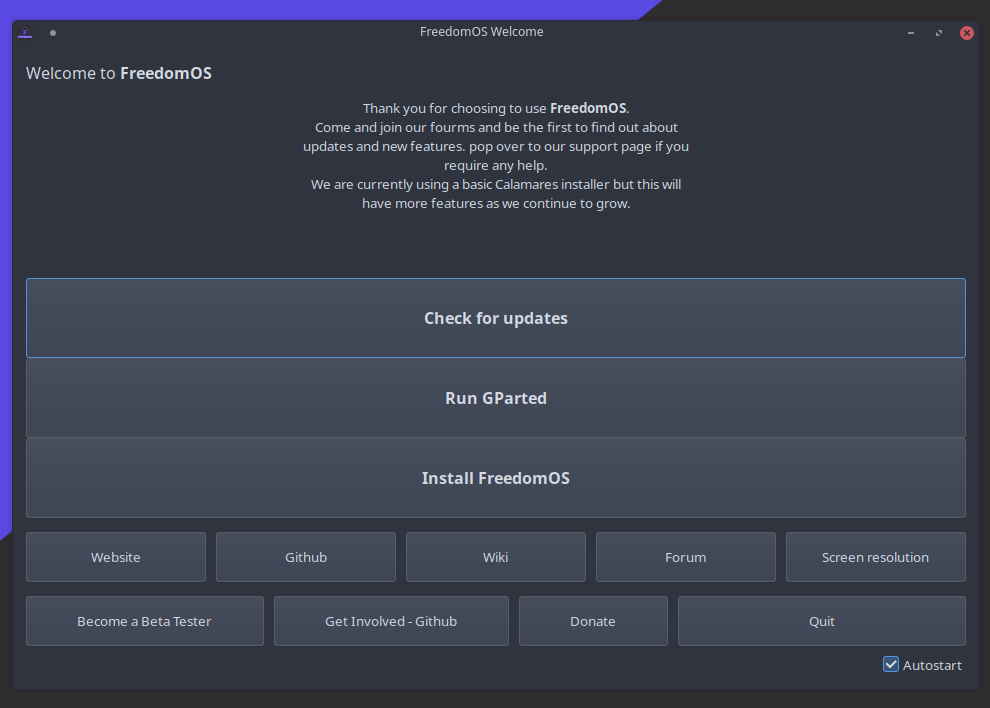

Basic Install Guide
========================

Installing FreedomOS
--------------------

Step 1 - Booting
----------------

Now you have created your Bootble USB, you will need to :guilabel:`Restart` and enter your boot menu.

.. hint::
    This is normaly done by pressing :guilabel:`F2`, :guilabel:`F10`, :guilabel:`F12` or :guilabel:`Del`. You may need to check
    on your motherboard manufactures support page to find the key combination.

Once you are in your boot menu, you will need to use your :guilabel:`arrow keys` to select your USB drive.

Press :guilabel:`Enter` to select the first menu item. You will now boot into the live environment.

.. note::
    Any changes you make in the live session won't be saved!!

Step 2 - Updating
-----------------

Once you are in the live session you will see the :guilabel:`FreedomOS Welcome` (see image below).

.. hint::
    Click on the option :guilabel:`Check for updates` this will ensure the installer and any dependencys are up to date.

.. warning::
    You may not have this option if you are using an older build of the ISO. To update the system you will need to open a
    :gullabel:`Terminal` (You can do this by clicking start and typing :gullabel:`Konsole`) and typing the comand below.

.. code-block:: console
    pacman -Syyu

Step 3 - Installing
-------------------

Click on :guilabel:`Install FreedomOS`.
This will launch the Calamares installer.

