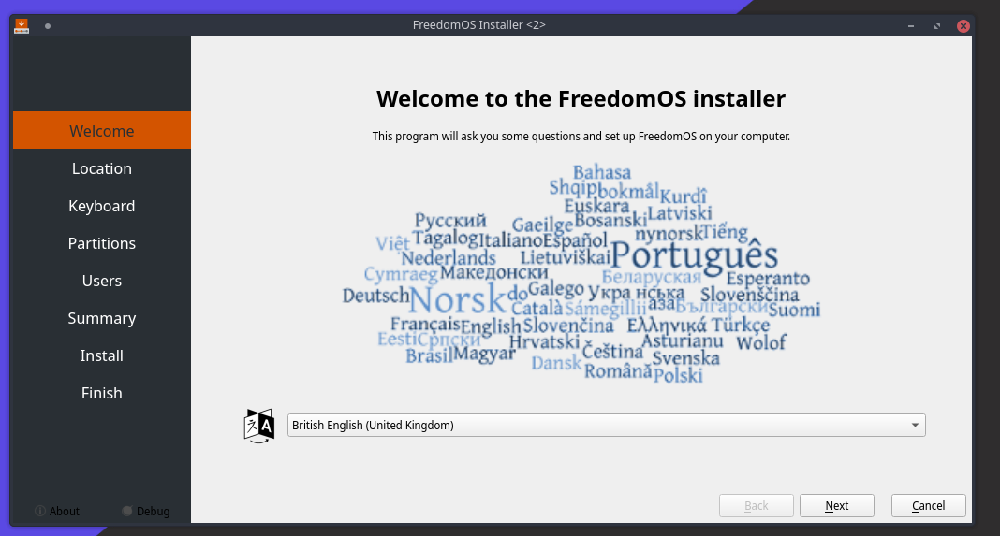
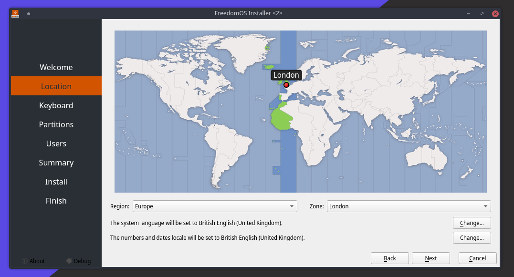
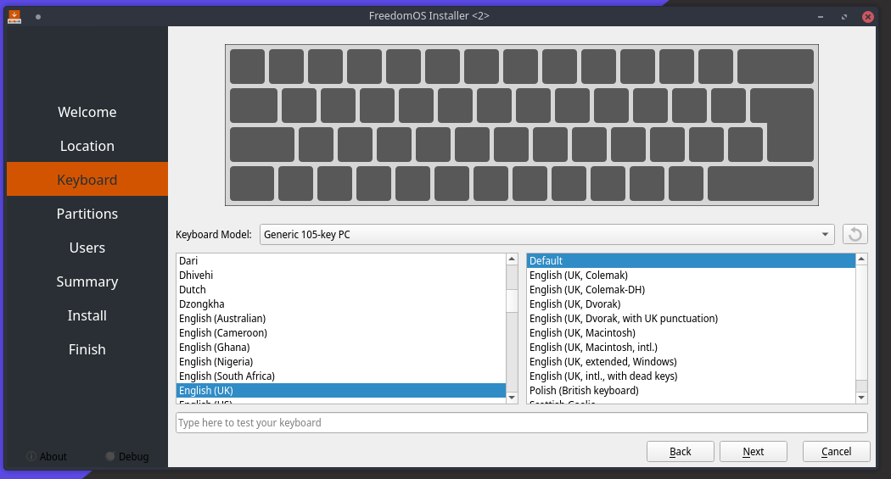
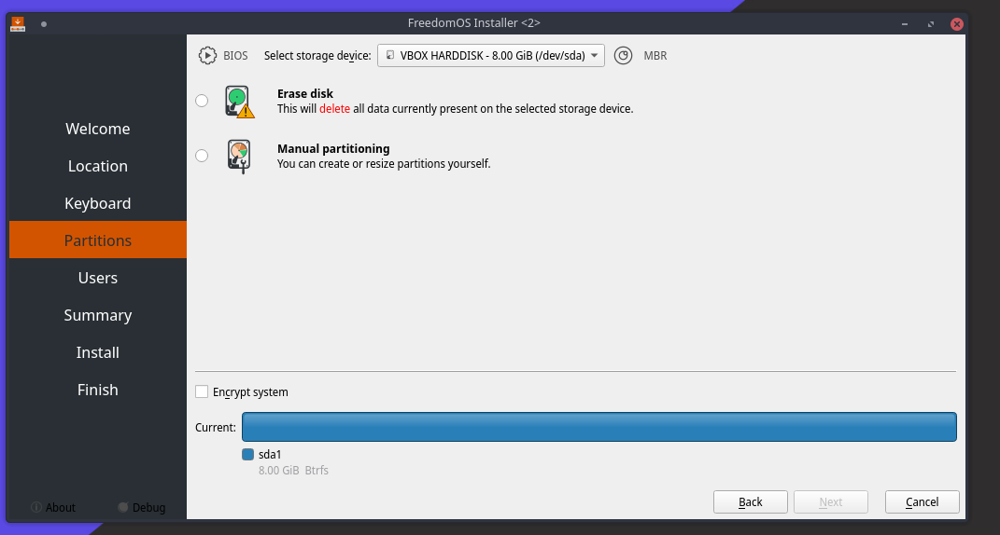
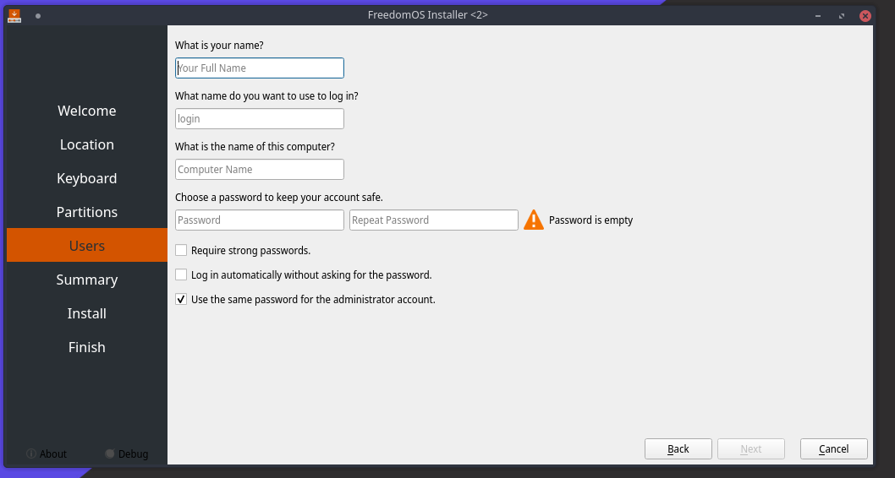
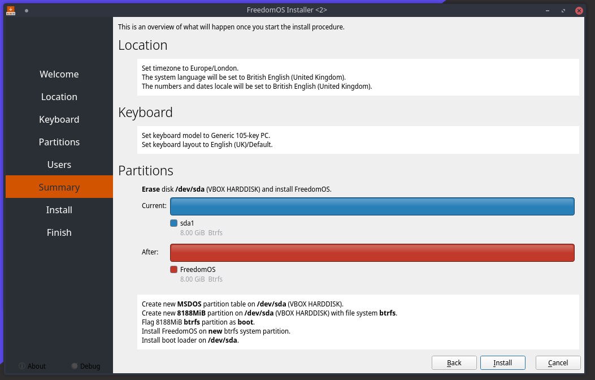
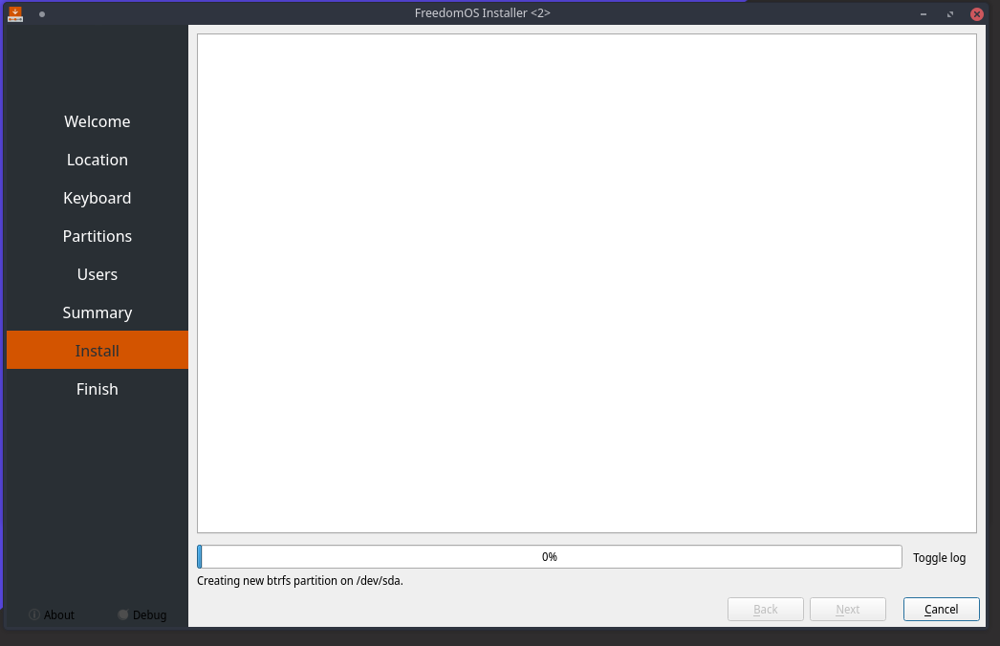
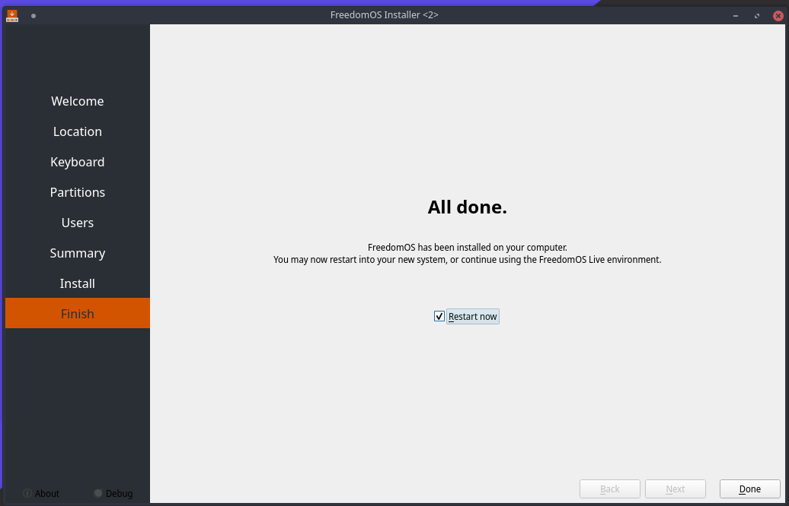

Basic Install Guide
========================

Installing FreedomOS
--------------------

Step 1 - Booting
----------------

Now you have created your Bootble USB, you will need to :guilabel:`Restart` and enter your boot menu.

.. hint::
    This is normaly done by pressing :guilabel:`F2`, :guilabel:`F10`, :guilabel:`F12` or :guilabel:`Del`. You may need to check
    on your motherboard manufactures support page to find the key combination.

Once you are in your boot menu, you will need to use your :guilabel:`arrow keys` to select your USB drive.

Press :guilabel:`Enter` to select the first menu item. You will now boot into the live environment.

.. note::
    Any changes you make in the live session won't be saved!!

Step 2 - Updating
-----------------

Once you are in the live session you will see the :guilabel:`FreedomOS Welcome` (see image below).

.. hint::
    Click on the option :guilabel:`Check for updates` this will ensure the installer and any dependencys are up to date.

.. warning::
    You may not have this option if you are using an older build of the ISO. To update the system you will need to open a
    :guilabel:`Terminal` (You can do this by clicking start and typing :guilabel:`Konsole`) and typing the comand below.

.. code-block:: console

    sudo pacman -Syyu

.. figure:: images/install/checkforupdates.png
    :width: 884px
    :align: center

Step 3 - Installing
-------------------

Click on :guilabel:`Install FreedomOS`.
This will launch the Calamares installer.

3.1 - language
---------------

Choose your :guilabel:`language` by pressing the dropdown menu and press :guilabel:`Next`.

3.2 - Region & Timezone
------------------------

Select your :guilabel:`Region` and :guilabel:`Timezone` using the dropdown menu and press :guilabel:`Next`.

3.3 - Keyboard layout
---------------------

Select your :guilabel:`Keyboard Layout` and press :guilabel:`Next`.

.. note::
    This will normally be done for you when you set your :guilabel:`Region`.

3.4 - Drive selection
---------------------

Select the :guilabel:`Drive` you want FreedomOS installing on using the dropdown menu.
If your drive has nothing on it then select :guilabel:`Erase`.

.. note::
    If the :guilabel:`Drive` contains another operating system then you will also have the option to install :guilabel:`Along side` (Duel Booting)

.. warning::
    This process will :guilabel:`Format` the drive!!
Then press :guilabel:`Next`

3.5 - Account creation
---------------------

Fill in the :guilabel:`Boxes` to setup your :guilabel:`Account`

.. note::
    If you want :guilabel:`Auto Login` then check the :guilabel:`Log in automatically`box.

Then press :guilabel:`Next`

3.6 - Confirmation
------------------

Here you can check options and make sure your happy with them. Once you are press :guilabel:`Install`

3.7 - Install Process
---------------------

The install process has started. This may take between 5-15 minutes depending on your computer hardware.
Go and grab yourself a cup of tea and a sandwitch.

3.8 - Install compleate
-----------------------

Install compleate, if you are finished with the :guilabel:`Live session` then click the :guilabel:`Restart now` checkbox and press :guilabel:`Done`

Step 4 - Booting into your new OS
---------------------------------

Once your computer has :guilabel:`Restarted` remove your :guilabel:`USB drive`.
This will allow the system to boot up normally.

.. note::
    Your login credentials are the same ones you created during the install.

