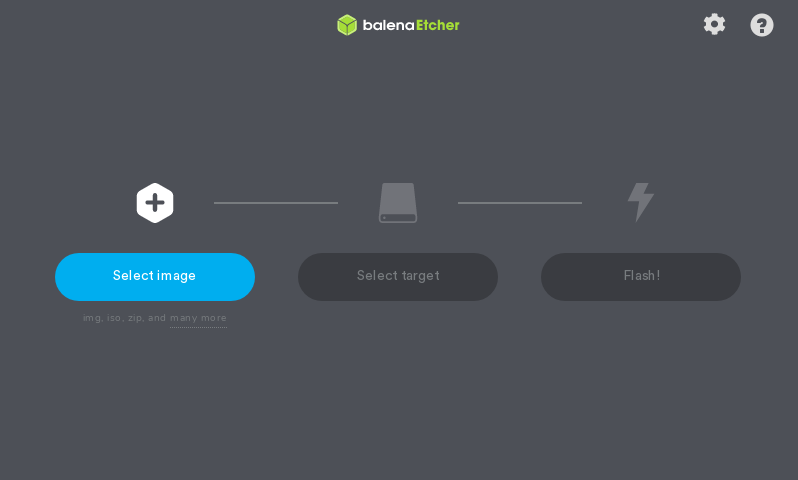

Setup USB Drive.
======================

Getting the necessary tools
----------------

Before you can flash your newly downloaded ISO file to a USB Stick, you'll need a program called ``balenaEtcher`` to flash your ISO file to a USB.

You can get balenaEtcher for your machine at https://www.balena.io/etcher/

Once you have downloaded balenaEtcher for your platform, set it up so that you see a window similar to the one shown in the image above.

.. hint::
    For Linux you will want to make the .AppImage file that you downloaded executable in its properties (:menuselection:`right-click the balenaEtcher .AppImage file --> Properties --> Permissions`) so that you can open the file normally.
    For Windows you will need to install balenaEtcher first unless you have downloaded the portable version instead.

Flashing your FreedomOS ISO file to your USB
-------------------------------------

.. warning::
    If you have data on the USB drive you want to flash ISO onto, back it up elsewhere or else it will be permanently lost when you flash your ISO file onto it.

1. Plug in your USB

2. Open balenaEtcher

3. Click :guilabel:`Select image` and select the FreedomOS ISO file you downloaded

4. Click :guilabel:`Select target` and select your USB and then hit Continue

5. Click :guilabel:`Flash!` and authenticate if required

This process may take a while, but once you are done you can move on to the next step:
